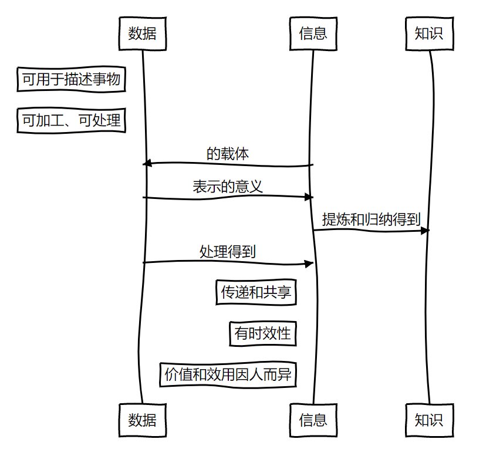
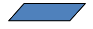
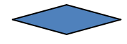

# 信息技术快速复习指南

🔰*本文由铜芯圆团队100%原创，并经过**桂明老师**和**袁中果老师**认证*

## 目录

[TOC]

## 本指南正确食用方法

你好！这份指南可以帮你迅速复习高一信息技术的各种知识，从而在信息技术学考中取得好成绩。

### 适合人群

以下人群适合马上开始阅读：

* 认真听**过**信息技术课的同学
* 已掌握Python基础知识的同学
* Python高手
* 有其它语言编程经验的同学
* 知道什么是python的同学

以下人群不适合阅读本指南：

* 不知道什么是Python的同学

不适合人群建议在阅读本指南前进行以下活动：

* 百度百科查看什么是Python

### 格式约定

本文主要使用以下格式：

* 正文：普通文本

* **加粗文本**：表示要强调的内容

* ==高亮文本==：桂明老师和某巨佬给出的建议

* *斜体文本*：表示拓展内容，虽然学考不考，但是有助于你进行理解。如果你看不懂部分斜体内容，直接忽略就好

* `代码`：一般是在一个知识点后面的示例

* ```
  代码块：
  和代码的用途相同，只不过是多行的
  ```

* [超链接](#格式约定)：你在看到一些内容的时候可能有点忘了之前的内容，所以我们在部分原来出现过的名词中加上超链接，点击这个链接可以快速跳转到之前对这个名词的定义。在有特殊注明的情况下，超链接也有可能指向其它网站。

* <kbd>按键</kbd>：表示需要你按下的按键，通常可以在键盘上找到

* > 提示：你在操作过程中可能遇到的问题

### 关于盗版

本文档仅收费￥3.21。您的慷慨解囊是我们创作必不可少的支持，如果此副本是盗版，请您马上删除并购买正版。这不仅是对我们创作的支持，更是因为盗版可能会被篡改，增加您理解知识的难度，甚至造成误解。

*Copyright &copy; 2020 Relph Bridgman All Right Reserved.*

## 准备工作

> 提示：“准备工作”是你需要在电脑上进行的、为了与学考所用计算机保持一致的配置，这些配置无需在学考时进行。

### 1. 安装 Python

访问`https://www.python.org/downloads`或者直接[点击此处](https://www.python.org/downloads)访问Python官方下载页，并下载最新版本的Python。

> 提示：学考计算机使用的版本是Python 3.7，但是你仍然可以安装Python 3.8，因为学考测试的特性在Python 3.8中未被修改。

下载完成后安装，:warning:请注意安装时<strong>钩选“Add Python to PATH”</strong>，这一点非常重要！

> 提示：钩选Add Python to PATH让你能够很方便地打开Python和pip。

如果你之前已经安装过Python，按下<kbd>Windows</kbd>+<kbd>R</kbd>组合键，然后输入`python`并回车，如果打开了Python就一切正常；如果提示“Windows找不到文件'`python`'”，请从控制面板卸载Python，然后重新安装。

### 2. 安装学考需要的扩展包

学考需要使用一些第三方Python包，请按如下步骤进行安装：

1. 按下<kbd>Windows</kbd>+<kbd>R</kbd>组合键，输入`cmd`回车；

2. 在命令行窗口输入`pip install numpy matplotlib pandas xlrd -i https://pypi.tuna.tsinghua.edu.cn/simple`，回车，坐等安装完成。

   > 提示：如果提示`'pip'不是可执行文件`，请检查你的Python是否正确安装。

在python中输入`import numpy,matplotlib,pandas,xlrd`来查看是否安装成功：如果没有任何输出，说明安装成功；如果有错误提示，说明安装失败。

## 一、数据与大数据（20分）

### 1.基本概念

数据：描述事物的符号记录。

信息：依附字符等载体，通过各种途径进行传播，能够帮助获取者了解情况、形成判断或做出决策的内容。

知识：人们在实践中所获得的认识和经验的总和、认识世界的成果。

二者的特征与关系如图:arrow_down:



### 2.关于数字化（即信息→数据）

#### (1)数字化

把信息转变为数据，便于获取数据，存储、处理、传输信息。

#### (2)数字化的方式：两种。

**数字信号**：散点，离散的。.png)

**模拟信号**：拟合函数，连续的。.jpg)

#### (3)进制问题

只要求2转10、10转2

①表示： (x)<sub>k</sub>即k进制下的x

②十进制转二进制：除2取余法。

把数除以2，记录余数，**直到商为0为止**，**倒序**排列余数即为二进制。如图。

（**注意**：余0也要写）

.png)

③二进制转十进制：按权展开求和法。

| 二进制                                     | 1             | 0            | 0            | 1                   |
| ------------------------------------------ | ------------- | ------------ | ------------ | ------------------- |
| 位数                                       | 4（千）       | 3（百）      | 2（十）      | 1（个）             |
| 所代表的十进制数值（2<sup>位数减一</sup>） | $1\times10^3$ | $0\times2^2$ | $0\times2^1$ | $1\times2^0$        |
| 十进制                                     |               |              |              | 9（上一行四者之和） |

### 3.计算机常识

#### (1)存储

一个“0”或“1”为一个二进制位（bit），**简称b**。

8个二进制位为一个字节（byte），**简称B**。

单位从小到大排列：b B KB MB GB TB PB EB

除了1B=8b外，后一个都是前一个的1024倍。

#### (2)常见文件格式

音频：WAV、MP3、AMR、APE。

视频：AVI、WMV、MP4。

图像：JPG／JPEG、PNG、BMP

文本：txt

表格：xls、xlsx

以逗号分隔的纯文本：csv

### 4.字符编码

ASCII（美国信息交换标准码）：用二进制数存储字符。

字母、数字和符号占1b，汉字为2b。

### 5.图像与视频

#### (1)基本概念

①像素：组成图像的小方格，具有明确位置和色彩数值。

②颜色深度：与像素能表示的颜色数量有关。颜色深度=n，则能表示2<sup>n</sup>种颜色

③帧：构成视频的图像，快速播放“帧”即为视频。24帧/s即可形成流畅画面。

#### (2)存储容量计算

图像所占的存储容量**（B）**＝水平像素数＊垂直像素数＊颜色深度／8 

### 6.音频

#### (1)基本概念及原理

数字化音频的原理：采样→量化→编码

采样：以相等的时间间隔来测得声音模拟信号的模拟量值，频率单位是赫兹（Hz）

量化：将采样值变换到最接近的数值。

量化位数：量化位数=n，即分为2<sup>n</sup>个量化等级（音频中的“颜色深度”）

#### (2)存储容量计算

音频所占的存储容量**(B)**＝采样频率(Hz)*量化位数＊声道数＊时长(s)／8

### 7.压缩

#### (1)原理

在不损失有用信息的前提下，按照一定的编码规则对数据进行重新组合

例如：aaabbb(占6b)→压缩→3a3b(占4b)

#### (2)两种压缩

有损压缩、无损压缩，区别：是否能还原、压缩率不同。

### 8.大数据

大数据技术：对巨量数据资源进行采集、提取、存储、分析和表达。

#### (1)特征

**巨量性、多样性、迅变性、价值性**

#### (2)应用

生活服务、智慧城市、医疗健康、社区管理。

## 二、程序与算法基础（50分）

### 1.概念

程序：一组可执行的计算机指令。

算法：一个运算序列，描述了计算机如何将输入转化为输出的过程。（可以看成：程序的特定模板）

算法的特征：有输入、有输出 、有穷性、可行性 、确定性 。

### 2.算法的表示方法

自然语言、伪代码（类似于程序设计语言的代码）、流程图（见下表）。

| 流程图符号                               | 名称         | 功能                                                         |
| ---------------------------------------- | ------------ | ------------------------------------------------------------ |
|  | 开始、结束框 | 表示算法的开始或结束                                         |
|  | 输入/输出框  | 表示输入或输出数据                                           |
|  | 处理框       | 框中指出要处理的内容，此框有一个入口和一个出口               |
|  | 判断框       | 用于表示条件判断及产生分支的情况，通常上面的顶点表示入口，视需要用另外 3 个顶点来表示出口 |

## 三、使用Python进行编程

### 1. 量与类型

#### 1） 常量类型

常量就是不可变的量。Python最常用（可能）的类型是整数，名称是`int`。直接输入一个整数，比如1、345，就是整数类型。字符串是单引号（`''`）、双引号（`""`）或者三引号（`'''`或`"""`）内的内容，名称是`str`，常用于表示文本。比如`'Hello'`、`"world"`、`'123'`都是字符串。

> 提示：无论你认为引号中是什么，**只要该内容在引号中**，Python就会当作字符串处理。比如'`123'`虽然看上去像数字，但是它是一个字符串。使用`int('123')`来将它转换为整数。

*三引号主要是用于跨行的字符串（单引号和双引号是不可以跨行输入的），比如：*

```python
'''
Hello,
World!
'''
```

浮点数就是我们平时说的小数（当然，也包括整数），名称是`float`，由数字和小数点构成，比如`42.195`就是浮点数。*如果你需要用浮点数来表示一个整数，请使用`float`函数或者在整数后面添加`.0`来将整数转换为浮点数。例如：`float(123)`、`123.0`都是浮点数。*将浮点数转换为整数可以使用`int`函数，比如`int(123.5)`就会得到整数`123`。==桂老师特别强调：`int`函数会直接取整数部分，而不是四舍五入。==将字符串转换为浮点数的方法是使用`float`函数，比如`float('123.456')`就将`'123.456'`转换成了浮点数。

> 注意：无论你想把字符串转换成整数还是浮点数，请务必确认字符串里包含对应的数字，比如如果输入`int('abcd')`就会报错，因为`'abcd'`中没有整数。

*除了将字符串转换为整数和浮点数之外，也可以通过`str`函数将整数或浮点数转换为字符串，比如`str(123)`就会得到字符串`'123'`。*

> 注意：中文标点和英文标点有区别，请注意区分。

布尔值只有两个，`True`和`False`，有点像二进制里的`1`和`0`。

> 注意：Python是区分大小写的，布尔值是`True`和`False`，而不是`true`和`false`。

#### 2） 变量

变量是用于存储量的“空间”。变量名可以由**英文字母、数字、下划线和汉字**组成，比如`var`、`number1`、`my_password`、`CurrentTime`都是合法的变量名，但`$$$`、`bizwofficial@gmail.com`不是合法的变量名。==巨佬温馨提醒：变量名不能以数字开头，也不能是纯数字或者Python中的关键字！==

> 注意：虽然Python支持使用汉字作为变量名，但是用汉字可能造成解码问题，导致程序无法执行。尤其是学考时请一定不要冒险，别使用中文变量名。

你可以让变量等于任何值，*而且不需要指定变量的类型*。使用赋值号（`=`）进行赋值，==桂老师特别强调：赋值号和等号虽然是同一个符号，但意义不同！==通过几个例子来理解一下：

```python
a = 'Hello world!'               #让变量等于字符串
b = 12345                        #让变量等于整数
c = 192.168                      #让变量等于浮点数
a = 'Hi!'                        #还可以更改一个变量的值
b = 123.45                       #甚至变量所存储的量的类型也可以改变。
```

> 提示：井号（`#`）开头的文本是注释，会被Python直接忽略。

#### 3） 容器

所谓容器，就像它的字面意思一样，是可以容纳多个量的容器。这些量不仅值可以不同，类型也可以不同。Python中容器主要有四种，列表、*元组*、*集合*和*字典*。**其中学考只要求掌握列表**。列表，名称是`list`，是由一对中括号`[]`括起来的容器，其中元素与元素之间使用逗号隔开。例如，`[1, 2, 3]`、`['a', 'b', 'c']`、`[1, 'a', 2, 'b', True]`都是合法的列表。列表可以使用`列表名[下标]`的形式访问其中的元素。**下标从`0`开始**，也就是说列表的第一个元素的下标是`0`。举个例子：

> 注意：下面的代码块不可以直接插入到`.py`文件里，这是模拟你使用Python的交互式界面时的输入和输出。在交互式界面下，运行一行代码后可以立即看到输出，而且要打印内容不需要使用`print()`函数，直接输入要打印的内容即可。按下<kbd>Windows</kbd>+<kbd>R</kbd>，输入`python`并回车即可进入交互式界面。

```python
>>> a = [1, 2, 3]
>>> a[0]			                     #列表元素从0开始
1
>>> a[1]
2
>>> a[2]
3
>>> a[3]								#列表一共只有三个元素，所以最大下标是2
Traceback(most recent call last):          #Python报错了
    ...
IndexError: list index out of range
```

> 注意：初学者会经常忘记列表下标从`0`开始，一定记牢这一点！

==以下至快速复习前为选看内容==*元组的名称是`tuple`，和列表很类似，但不是由中括号括起来，而是由小括号括起来的，比如`(1, 2, 3)`就是一个元组。元组和列表之间（可能）惟一的区别就是，列表是可变的，而元组是不可变的。“可变的”是指列表允许添加/删除/修改元素，但元组不可以。当元组进行这些操作时，不会在原有的元组进行修改，而会得到一个新元组。*将在后面的内容中详细讨论列表的添加/删除/修改元素操作。

*集合，名称是`set`，格式和数学一样也是由大括号括起来的，性质也和数学中的集合有点像。集合中不允许存在两个值相同的元素。比如`{1, 2, 3}`是合法的集合，但`{1, 1, 2}`不是合法的集合，因为其中有两个`1`。集合还有一点与列表的区别，非常重要，就是它是<strong>无序的</strong>，也就是说它没法通过`集合名[下标]`的形式来访问其中的元素。字典，名称`dict`，是Python中的一种映射类型，由“键-值”对组成，每个键-值对的格式是`key:value`，key是键，value是值，这里的键和值都必须是Python中的合法常量类型。而整个字典又由一些键-值对组成，这些键-值对之间用逗号分开，字典由大括号括起来。比如：`{'name': 'Bob', 'sex': 'male', 'birth date': '2.15', 'age': 16}`就是一个有实际意义的字典，它记录了一个叫Bob的人的个人信息。虽然字典和集合一样是无序的，但是它可以通过`字典名[键]`的形式访问它的值。举个例子：*

```python
>>> card = {'name': 'Bob', 'sex': 'male', 'birth date': '2.15', 'age': 16}
>>> card['name']                                          #检查Bob的姓名
'Bob'
>>> card['age']                                           #检查Bob的年龄
16
>>> simple_card = [card['name'], card['age']]             #用Bob的姓名和年龄新建一个列表
>>> simple_card
['Bob', 16]
```

> *注意：输入键的时候一定要输入完整形式，比如上面访问姓名的时候，使用`card['name']`而不是`card[name]`。*

*在各个容器之间可以很方便地进行转换。*

| 转换规则     | 转换方法       |
| ------------ | -------------- |
| 容器a->元组b | `b = tuple(a)` |
| 容器a->列表b | `b = list(a)`  |
| 容器a->集合b | `b = set(a)`   |

> *提示：通过把一个列表转换成集合再重新转换回列表可以有效地去除列表中的重复项。举例：*
>
> ```python
> >>> a = [1, 1, 2, 3, 5, 7]
> >>> a
> [1, 1, 2, 3, 5, 7]
> >>> a = list(set(a))
> >>> a
> [1, 2, 3, 5, 7]
> ```

#### 4） 本节快速复习⚡

本节介绍了Python中的基本类型，包括常量类型和容器类型。快速回顾一下吧：

| 类型   | 名称    | 特性                              |
| ------ | ------- | --------------------------------- |
| 整数   | `int`   | 就是整数                          |
| 浮点数 | `float` | 小数                              |
| 字符串 | `str`   | 存放多个字符                      |
| 布尔值 | `bool`  | 真（`True`）或假（`False`）       |
| 列表   | `list`  | 存放多个值*/引用*的可变的有序容器 |

### 2.运算与输入输出

在本节中你将复习**一大堆**运算符和运算规则，请确保你的大脑状态良好！

#### 1） 数学运算

数学运算主要是指Python中数值类型（整数和浮点数）之间的运算。这些运算主要包括：

| 运算方法 | 运算符 | 例子               |
| -------- | ------ | ------------------ |
| 加法     | `+`    | `1+1`，`2.5+7.5`   |
| 减法     | `-`    | `1-1`，`2.5-7.5`   |
| 乘法     | \*     | `1*2`，`2.5*4`     |
| 除法     | /      | `1/2`，`2.5/4`     |
| 整除法   | //     | `1//2`，`2.5//4`   |
| 余数     | %      | `5%2`，`4%2`       |
| 乘方     | **     | `2**3`，`10**(-1)` |

这里面非常容易混淆的两个运算符是除法`/`和整除法`//`。当你使用除法且被除数和除数均为整数时，如果除数无法整除被除数，将返回一个浮点数，比如`3/2=1.5`，`1/3=0.3333333333333333`等。而当你使用整除法的时候，无论除数是否整除被除数，都会返回整数，当除数无法整除被除数时将会返回商的整数部分，比如`3//2=1`，`1//3=0`。而余数的作用和除法+整除法的作用是相等的：

```python
a % b = a - b * (a // b)
```

乘方的用法是`a ** b`，返回的结果就是a^b^。如果是开平方的话，除了用`a**0.5`之外，还有一个常用的函数`math.sqrt`也可以达到相同的效果，举个例子：

```python
>>> import math                        #在使用math.sqrt函数之前先导入math包
>>> math.sqrt(1024)
32
```

> 注意：如果乘方符号`**`两边是比较复杂的表达式，请加括号，例如`2**-1`是错误表达式，正确形式是`2**(-1)`。

很多Python的入门书都会花很长的篇幅来详细讲解Python中运算符的优先级，但是我觉得没这个必要。你只需要记住：Python中运算符的优先级和数学中的优先级基本上差不多，如果遇到不确定的情况，加括号就可以。比如：

```python
>>> 1 + 2 / 3
1.6666666666666665
>>> (1 + 2) / 3
1
```

#### 2） 逻辑运算

逻辑运算被广泛地运用于[逻辑控制](#3. 逻辑控制)当中。Python中有以下逻辑运算符：

| 运算方法 | 运算符 | 例子            |
| -------- | ------ | --------------- |
| 相等     | `==`   | `1==2`，`4==4`  |
| 不相等   | `!=`   | `1!=2`，`4!=4`  |
| 大于     | `>`    | `1>2`，`4>3`    |
| 小于     | `<`    | `1<2`，`4<3`    |
| 不大于   | `<=`   | `1<=2`，`4<=4`  |
| 不小于   | `>=`   | `1>=2`，`4>=4`  |
| 并且     | `and`  | `1>=2 and 4>=4` |
| 或者     | `or`   | `1>=2 or 4>=4`  |
| 非       | `not`  | `not 1>=2`      |
| 属于     | `in`   | `1 in [1,2,3]`  |

> 注意：等号`=`是用来给[变量](#2） 变量)赋值的，而双等号`==`是用来判断两个值是否相等的。

每个逻辑判断都回返回两个[布尔值](#1） 常量类型)中的其中一个，`True`或者`False`。当判断条件为真的时候返回`True`，否则返回`False`。其中有三个运算符比较特殊，是“与、或、非”，`and`、`or`和`not`。`and`的功能是当它两边的表达式的值都为`True`的时候返回`True`，否则返回`False`；`or`的功能是当它两边的表达式的值有任意一个为`True`的时候就返回`True`，仅当两个表达式均为`False`的时候才返回`False`；`not`的功能是反转状态，*它是一元运算符（意思是它的用法不是`1>0 not 1==2`而是`not 1==2`）*，当它右边的表达式结果是`True`的时候就返回`False`，右边表达式结果是`False`的时候就返回`True`。举几个例子：

```python
>>> 1==2
False
>>> 1==1
True
>>> 1==1 and 1==2
False
>>> 1==1 or 1==2
True
>>> 1!=2
True
>>> 1==1 or 1!=2
True
>>> not 1!=2
False
```

> 提示：不同类型的量（比如字符串和整数）之间不能直接进行比较大小。

#### 3） 字符串运算

在Python中可以使用多种方法操作字符串。先介绍运算符：

| 运算方法 | 运算符 | 例子                |
| -------- | ------ | ------------------- |
| 拼接     | `+`    | `'Hello'+' World!'` |
| 复制     | `*`    | `'Hello World'*6`   |

再来说字符串方法（==此表格为选看内容==）：

| 运算方法                               | 方法                | 例子                                |
| -------------------------------------- | ------------------- | ----------------------------------- |
| 删除右边的空白                         | `''.rstrip()`       | `'Hello   '.rstrip()`               |
| 删除左边的空白                         | `''.lstrip()`       | `'      World'.lstrip()`            |
| 删除左右两边的空白                     | `''.strip()`        | `'        Hello World    '.strip()` |
| 判断是否以特定字符串开始               | `''.startswith('')` | `'Hello World'.startswith('Hello')` |
| 判断是否以特定字符串结尾               | `''.endswith('')`   | `'Hello World'.endswith('World')`   |
| 查找子字符串的位置                     | `''.find('')`       | `'Hello World'.find('ello')`        |
| 把每个单词的首字母大写                 | `''.title()`        | `'hello world'.title()`             |
| 把字母全部转成大写                     | `''.upper()`        | `'hello world'.upper()`             |
| 把字母全部转成小写                     | `''.lower()`        | `'HELLO WORLD'.lower()`             |
| 将字符串中每处出现子字符串的部分都分割 | `''.split('')`      | `'hello,world'.split(',')`          |

上面的两个表格中对用法都描述得很清楚，我就不再详细讲解了。

#### 4） *容器运算*

> 提示：节标题为斜体表示整节内容都是选看内容。

Python中的容器也是支持运算的。本节将重点介绍列表和字典的运算方法。

##### 列表

实际上，列表与字符串很像（应该说字符串与列表很想），也可以使用`+`和`*`进行拼接和复制列表。举个例子：

```python
>>> [1, 2, 3] + [4, 5, 6]
[1, 2, 3, 4, 5, 6]
>>> [1] * 6
[1, 1, 1, 1, 1, 1]
>>> [[1]] * 6
[[1], [1], [1], [1], [1], [1]]
```

其中`*`是被广泛地使用的，但是`+`在实际应用中并不怎么常用，因为如果我们要在一个现有的列表末尾插入一个元素的话，使用`+`就需要`a = a + [6]`来操作，而这在Python中是被视为比较繁琐的。一般使用`list.append`方法在列表末尾插入元素，如果要插入多个元素可以使用逗号分隔开：

```python
>>> a = [1, 2, 3, 4, 5]
>>> a.append(6)
>>> a
[1, 2, 3, 4, 5, 6]
>>> a.append(7, 8, 9)
>>> a
[1, 2, 3, 4, 5, 6, 7, 8, 9]
```

> 注意：`list.append`函数会<strong>原地修改</strong>原有的列表。也就是说，你不需要使用`a = a.append(6)`，因为当调用`a.append(6)`时，列表`a`已经被修改了。

*如果要在列表末尾添加另一个列表中的元素，可以使用`list.extend`方法：*

```python
>>> a = [1, 2, 3, 4, 5]
>>> a.extend([6, 7, 8, 9])
>>> a
[1, 2, 3, 4, 5, 6, 7, 8, 9]
```

> 注意：`list.extend`方法也会原地修改列表。

*这两个方法都是在列表末尾插入元素。你也可以使用`list.insert`方法在列表中间插入元素，使用格式是`列表名称.insert(插入位置, 插入元素)`。比如：*

```python
>>> a=[1, 3, 4, 5]
>>> a.insert(1, 2)
>>> a
[1, 2, 3, 4, 5]
```

> 注意：列表元素的下标从`0`开始。

要将列表进行排序，无需手动实现任何算法，直接使用`list.sort`方法或`sorted`方法即可。这两个方法的唯一区别就是：`list.sort`方法会对列表进行原地修改，而`sorted`方法会生成一个新的列表。举个例子：

```python
>>> a = [1, 6, 3, 8, 4]
>>> sorted(a)                       #sorted不会修改原列表的值
[1, 3, 4, 6, 8]
>>> a                               #列表a并未被改动
[1, 6, 3, 8, 4]
>>> a.sort()                        #list.sorted方法直接修改原列表
>>> a
[1, 3, 4, 6, 8]                     #原列表被排序
```

Python中的排序默认是由小到大进行排序，如果你要使用由大到小排序，请加上参数`reverse=True`：

```python
>>> a = [1, 6, 3, 8, 4]
>>> sorted(a, reverse = True)
[8, 6, 4, 3, 1]
>>> a.sort(reverse = True)
>>> a
[8, 6, 4, 3, 1]
```

##### 字典

字典是不可以进行排序的，因为它是个无序的[容器](#3. 容器)。学考不要求掌握字典的相关操作，所以为了保持篇幅短小，在此处就不进行讲解了。

#### 5） 输入输出

在Python中，实现输入输出非常简单，这是因为Python是一个<b>类型不敏感</b>的语言。

##### 输入

直接使用`input`函数处理输入，比如`a=input()`这样一行代码就会在程序运行时等待用户的输入，并在输入完成后将收到的内容存放到变量`a`中。如果你要提供一些输入提示，可以在`input`的括号里写上一个提示字符串，例如`name=input('请输入你的姓名：')`。但是有一点非常重要的是，<strong>无论你认为你输入的类型是什么，`input`函数都会当作字符串处理。</strong>比如当你在程序运行时输入`10086`，虽然你可能觉得你输入的是整数，但是实际上存储到变量`name`中的是字符串`'10086'`。如果你需要用户输入一个整数（或浮点数）的话，可以搭配`int()`或`float()`使用：

```python
#这个程序用于将用户输入的两个整数相加
a = int(input('请输入第一个整数：'))
b = int(input('请输入第二个整数：'))
print('a+b=', a + b)

#实际运行效果
请输入第一个整数： 3
请输入第二个整数： 4
a+b=7
```

当你不知道用户输入的到底是整数还是浮点数时，可以使用`eval`函数把它转换为数（如果输入的内容可以转换成整数，就返回整数；如果输入的内容可以转换成浮点数，就返回浮点数）。举个例子：

```python
#这个程序用于将用户输入的两个整数或浮点数相加
a = eval(input('请输入第一个数：'))
b = eval(input('请输入第二个数：'))
print('a+b=', a + b)

#实际运行效果 1
请输入第一个数： 3
请输入第二个数： 4
a+b=7

#实际运行效果 2
请输入第一个数： 3.5
请输入第二个数： 4.5
a+b=8

#实际运行效果 3
请输入第一个数： 3
请输入第二个数： 4.5
a+b=7.5
```

可以看到，`eval`函数可以处理任何类型的数。==桂老师特别强调：学考要求友好性，在输入输出时请一定写好提示语，不要上来就让用户输入！正确形式举例：`a = eval(input('请输入第一个数：'))`反例：`a = eval(input())`==

<b>妈妈再也不用担心我分不清整数和浮点数啦！</b>

##### 输出

输出其实比输入还简单，因为连数字的类型都不用判断，直接用`print`函数就可以输出任何内容。比如`print(1)`就会输出1，`print(a)`就会输出变量`a`。要输出多个内容，可以用逗号分开，例如`print(a,b)`.`print`函数默认情况下在输出之后会添加一个换行，所以在执行第二个`print`函数之后你会发现两次输出的内容不在同一行里。这种情况下可以通过添加参数`end`来解决这个问题，格式是`end=分隔符`，其中`分隔符`是两个`print`语句输出的内容之间的分隔，必须是一个字符串。例如，令`end`等于一个空字符串就可以让两次输出之间连起来：

```python
a = 'Hello'
b = 'world!'
print(a,end = '')
print(b)

#实际运行结果
Helloworld!
```

#### 6） 本节快速复习⚡

在本节中，你复习了各种运算，快速回顾一下吧：

| 运算方法 | 运算符 | 例子               |
| -------- | ------ | ------------------ |
| 加法     | `+`    | `1+1`，`2.5+7.5`   |
| 减法     | `-`    | `1-1`，`2.5-7.5`   |
| 乘法     | \*     | `1*2`，`2.5*4`     |
| 除法     | /      | `1/2`，`2.5/4`     |
| 整除法   | //     | `1//2`，`2.5//4`   |
| 余数     | %      | `5%2`，`4%2`       |
| 乘方     | **     | `2**3`，`10**(-1)` |
| 相等     | `==` | `1==2`，`4==4`  |
| 不相等   | `!=`   | `1!=2`，`4!=4`  |
| 大于     | `>`    | `1>2`，`4>3`    |
| 小于     | `<`    | `1<2`，`4<3`    |
| 不大于   | `<=`   | `1<=2`，`4<=4`  |
| 不小于   | `>=`   | `1>=2`，`4>=4`  |
| 并且     | `and`  | `1>=2 and 4>=4` |
| 或者     | `or`   | `1>=2 or 4>=4`  |
| 非       | `not`  | `not 1>=2`      |
| 属于     | `in`   | `1 in [1,2,3]`  |
| 删除右边的空白                           | `''.rstrip()`       | `'Hello   '.rstrip()`               |
| 删除左边的空白                         | `''.lstrip()`       | `'      World'.lstrip()`            |
| 删除左右两边的空白                     | `''.strip()`        | `'        Hello World    '.strip()` |
| 判断是否以特定字符串开始               | `''.startswith('')` | `'Hello World'.startswith('Hello')` |
| 判断是否以特定字符串结尾               | `''.endswith('')`   | `'Hello World'.endswith('World')`   |
| 查找子字符串的位置                     | `''.find('')`       | `'Hello World'.find('ello')`        |
| 把每个单词的首字母大写                 | `''.title()`        | `'hello world'.title()`             |
| 把字母全部转成大写                     | `''.upper()`        | `'hello world'.upper()`             |
| 把字母全部转成小写                     | `''.lower()`        | `'HELLO WORLD'.lower()`             |
| 将字符串中每处出现子字符串的部分都分割 | `''.split('')`      | `'hello,world'.split(',')`          |

### 3. 逻辑控制

在本节你将复习如何使用`if`代码块和`while`代码块。在开始之前，请确保你已经完全掌握了[逻辑运算](# 2） 逻辑运算)的相关知识。

#### 1） `if`代码块

`if`代码块主要是用于当某个条件成立时执行一些语句的。最简单的`if`代码块的逻辑如下：

```flow
st=>start: 进入if代码块
cd=>condition: 判断条件是否成立
true=>operation: 成立时执行的操作
ed=>end: 结束if代码块
st->cd
cd(yes)->true->ed
cd(no)->ed
```

格式是：

```python
if 判断条件:
    语句1
    语句2
    ...
```

举个例子：

```python
a = eval(input(请输入数字1：))
if a != 1:
    print('输错了...')
if a == 1:
    print('没错！')
#实际运行效果 1
请输入数字1： 2
输错了...

#实际运行效果 2
请输入数字1： 1
没错！
```

> 提示：只有需要在条件成立时执行的语句才需要缩进。缩进一般可以通过按下<kbd>Tab</kbd>键来实现。注意，<strong>同一个代码块中各条语句的缩进应保持一致。</strong>

但是这样一个简单的程序还要写两个`if`代码块未免也太麻烦了。事实上，`if`代码块还提供了一个`else`代码块，用于处理当条件不成立时执行的语句。`if-else`代码块逻辑如下：

```flow
st=>start: 进入if代码块
cd=>condition: 判断条件是否成立
true=>operation: 成立时执行的操作
false=>operation: 不成立时执行的操作
ed=>end: 结束if代码块
st->cd
cd(yes)->true->ed
cd(no)->false->ed
```

格式如下：

```python
if 判断条件:
    语句1
    语句2
else:
    语句3
    语句4
```

举个例子：

```python
a = eval(input(请输入数字1：))
if a != 1:
    print('输错了...')
else:
    print('没错！')
#实际运行效果 1
请输入数字1： 2
输错了...

#实际运行效果 2
请输入数字1： 1
没错！
```

是不是简洁了不少。除了`if-else`代码块，Python还提供了一种`if-elif-else`代码块，用于判断多个条件。逻辑如下：

```flow
st=>start: 进入if代码块
cd=>condition: 判断条件1是否成立
elif=>condition: 判断条件2是否成立
op1=>operation: 条件1成立时执行的操作
op2=>operation: 条件1不成立，但条件2成立时执行的操作
op3=>operation: 条件1和条件2都不成立时执行的操作
ed=>end: 结束if代码块
st->cd
cd(yes)->op1->ed
cd(no)->elif
elif(yes)->op2->ed
elif(no)->op3->ed
```

格式如下：

```python
if 判断条件1:
    语句1
    语句2
    ...
elif 判断条件2:
    语句3
    语句4
    ...
elif 判断条件3:
    语句5
    语句6
    ...
else:
    语句7
    语句8
    ...
```

> 提示：在`if-elif-else`代码块中，你可以插入任意多个`elif`块。

举个例子：

```python
#这个程序可以用于判断输入的数的正负性
a = eval(input('请输入一个数：'))
if a < 0:
    print('你输入了一个负数！')
elif a > 0:
    print('你输入了一个正数！')
else:
    print('你输入了0！')

#实际运行效果 1
请输入一个数： 6
你输入了一个正数！

#实际运行效果 2
请输入一个数： -3
你输入了一个负数！

#实际运行效果 3
请输入一个数： 0
你输入了0！
```

这就是`if`代码块。<del>是不是非常简单？</del>

#### 2） `while`代码块

`while`代码块是用于只要条件满足就不停循环直到条件不再满足的。逻辑如下：

```flow
st=>start: 开始while循环
cd=>condition: 判断循环条件是否成立
op=>operation: 要循环执行的语句
ed=>end: 结束while循环
st->cd
cd(yes)->op->cd
cd(no)->ed
```

格式如下：

```python
while 判断条件:
    语句1
    语句2
    ...
```

举个例子：

```python
#这个程序可以用于循环输出文本
a = input('你想输出什么：')
n = int(input('你想输出几遍：'))
while n != 0:
    print(a)
    n = n - 1
print('输出完成！')

#实际运行效果
你想输出什么： 你好
你想输出几遍： 3
你好
你好
你好
输出完成！
```

> 提示：在使用`while`循环时，要注意不要让程序陷入**死循环**当中，确保程序在正确的时间可以结束`while`循环。当条件永远成立时，程序会进入死循环，永远不会结束。

#### *3） 进阶内容：行内`if-else`表达式*（选看内容）

> 提示：节标题为斜体表示整节内容都是选看内容。

行内`if-else`表达式与`if-else`语句块的逻辑相同，它可以用于当条件成立时将变量赋为一个值，而当条件不成立时将变量赋另一个值。格式是`n=a if 条件 else b`。这个语句的意义是当条件成立时令`n=a`，当条件不成立时令`n=b`。

#### 4） 本节快速复习⚡

在本章中你复习了`if`代码块和`while`代码块。快速回顾一下吧：

`if`代码块格式：

```python
if 判断条件1:
    语句1
    语句2
    ...
elif 判断条件2:
    语句3
    语句4
    ...
elif 判断条件3:
    语句5
    语句6
    ...
else:
    语句7
    语句8
    ...
```

`while`代码块格式：

```python
while 判断条件:
    语句1
    语句2
    ...
```

### 4. 循环控制

什么？刚才讲的`while`代码块不就是循环控制吗……没错，但是之所以不把`while`循环放在本章进行复习是因为`while`在很大程度上是依赖于逻辑运算的，所以与`if`一起放在逻辑控制中介绍了。而在本章中，你将复习`for`循环的基本和进阶用法。

#### *1） `range`函数和迭代器*（选看内容）

> 提示：节标题为斜体表示整节内容都是选看内容。

在信息技术课上老师并没有向我们介绍`for`循环的具体原理，但是非常推荐大家了解一下。相信大家都已经知道`for`循环的基本语法是`for 循环变量 in range(起始值, 最终值, 前进速度)`，而其中的`range`函数是什么意思呢？

`range`函数是**迭代器**的一个典型例子。迭代器是这样一个对象，每次调用它的`next`方法的时候都回返回一个新的值。举个例子：

```python
>>> a = range(1, 5)
>>> a.next()
1
>>> a.next()
2
>>> a.next()
3
>>> a.next()
4
>>> a.next()                      #迭代器中的所有值都已经输出完成了
StopIteration
```

当迭代器的所有值都输入完成之后就会返回`StopIteration`。事实上，还可以通过先前介绍过的[容器转换方法](# 3） 容器)来使`range`函数一次性地输出所有值：

```python
>>> a = range(1, 5)
>>> list(a)
[1, 2, 3, 4]
```

明明写的是`1`到`5`，为什么只有`1`到`4`呢？原因是与列表相同，`range`函数是不包括最后一个元素的。这就是迭代器，当你学习Python的类之后就可以自己编写迭代器了。

#### 2） `for`循环

`for`循环可以遍历一个迭代器，因此往往和`range`搭配使用实现循环指定次数。逻辑如下：

```flow
st=>start: 进入for循环
cd=>condition: 迭代器是否StopIteration
op=>operation: 循环中的操作
ed=>end: 结束for循环
st->cd
cd(yes)->op->cd
cd(no)->ed
```

一般来说，如果使用`for`循环就不用担心产生死循环了（当然除非你是高手写了一个永远不`StopIteration`的迭代器，但是真正的高手也不会犯这种低级错误）。举个例子：

```python
for i in range(5):
    print('第' + i + '次循环')

#实际运行效果
第1次循环
第2次循环
第3次循环
第4次循环
第5次循环
```

没错，你也可以使用`range(循环次数)`的方式来进行循环，这样就不用担心记不住`range`函数不包括最后一个元素了。我比较推荐这种写法。

#### *3） 考试神器：列表推导*（选看内容）

>提示：节标题为斜体表示整节内容都是选看内容。

向你隆重介绍一个考试技巧。正常情况下，如果你要生成一个包括`'第1次循环'`到`'第5次循环'`的列表，你可能需要这么写：

```python
a = []
for i in range(5):
    a.append('第' + i + '次循环')
```

但是使用列表推导一步即可：

```python
a = ['第' + i + '次循环' for i in range(5)]
```

## 四、数据处理（26分）

### 1.数据的保护

#### (1)主要威胁

计算机病毒、黑客攻击、数据存储介质损坏和个人失误。

#### (2)如何保护

加密、备份。

==*本章其它内容只需要学会撰写报告即可。*==

### 2.如何撰写报告

对数据进行采集（考试时已经采集好了）、整理、分析和可视化表达。

**格式：标题、前言、正文、结论和建议以及附录（可不写）。**

#### (1)整理

原则：完整性、统一性（统一标准）和准确性。

方法：去重、补漏和勘误。

#### (2)可视化

**考试时直接把存储着数据的文件与程序（考试时会提供）放在“桌面”上，并运行程序即可。**

## 四、智能时代（4分）

### 人工智能

定义：利用数字计算机或者数字计算机控制的机器模拟、延伸和扩展人的智能， 感知环境、获取知识并使用知识获得最佳结果的理论、方法、技术及应用系统。

几个AI技术：图像识别与生物特征识别、自然语言处理、深度学习。

测试智能程度的方法：图灵测试。

## 后记

感谢你花了如此多的耐心读完本指南，希望你能有所收获！信息技术课本中的部分内容未在本指南中加以讨论，例如：

- `turtle`画图方法
- 使用`pandas`库进行数据分析

这是因为学考时相关资料会提供给你，无须提前复习。你可以在作者之一的主页https://github.com/bizwofficial上找到更多有趣的Python代码。谢谢阅读！

<center><b>祝你在学考中取得好成绩！</b></center>

*本文使用Markdown编辑，PDF版由Pandoc自动生成，部分图片来源于百度百科。*